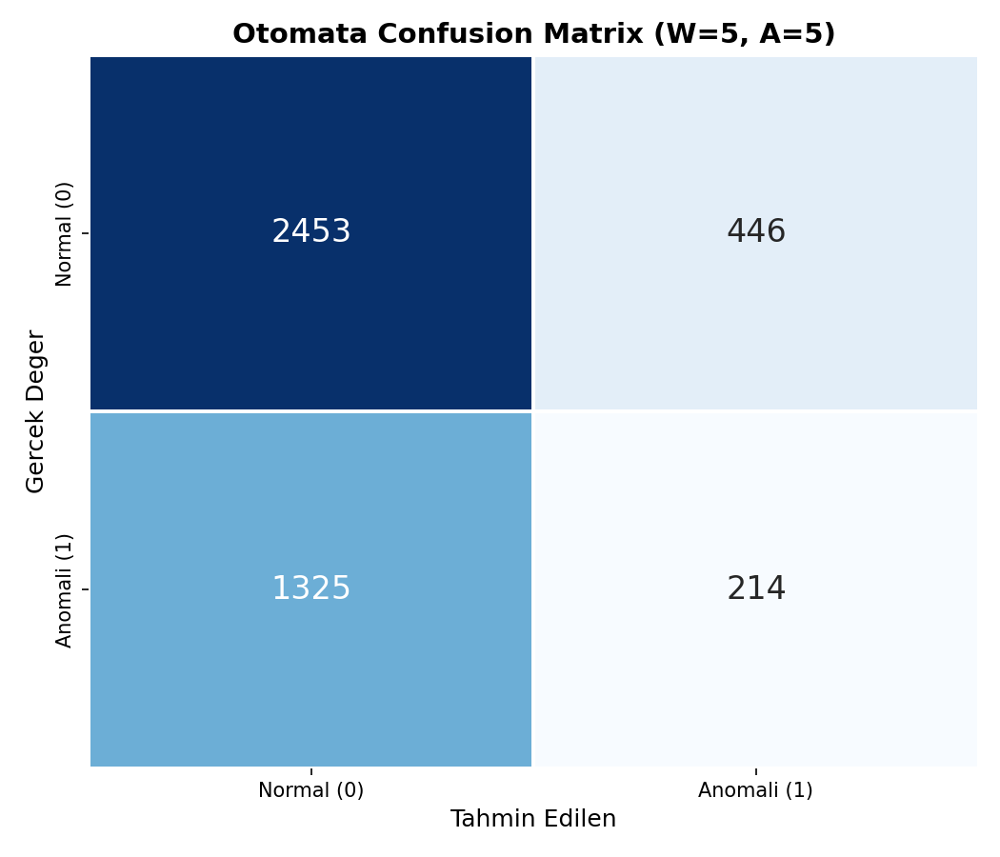
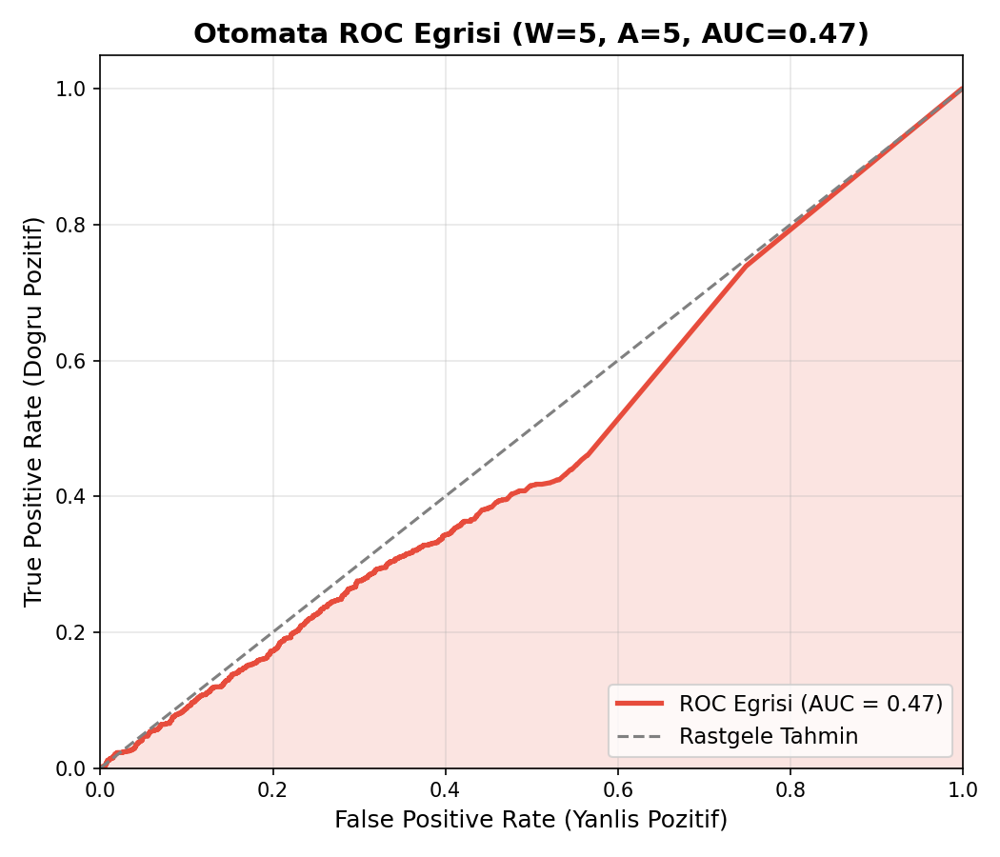
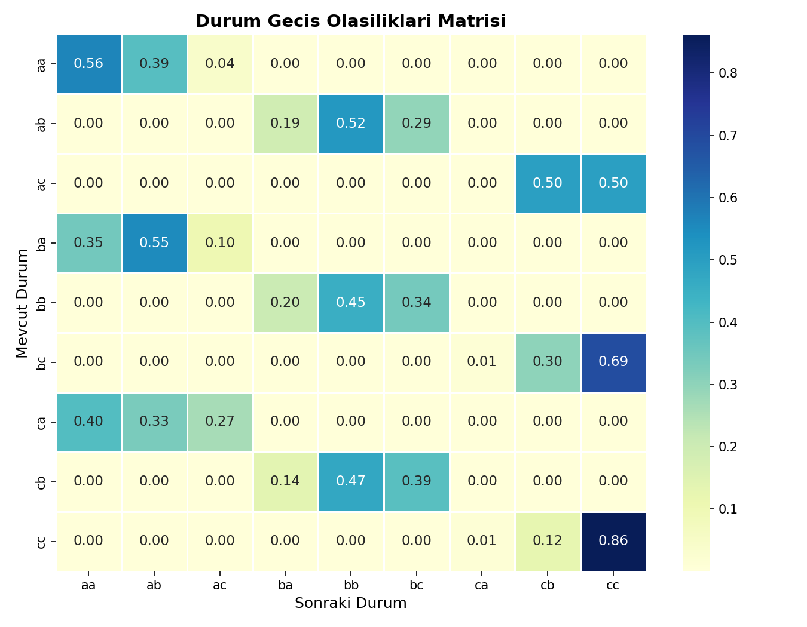
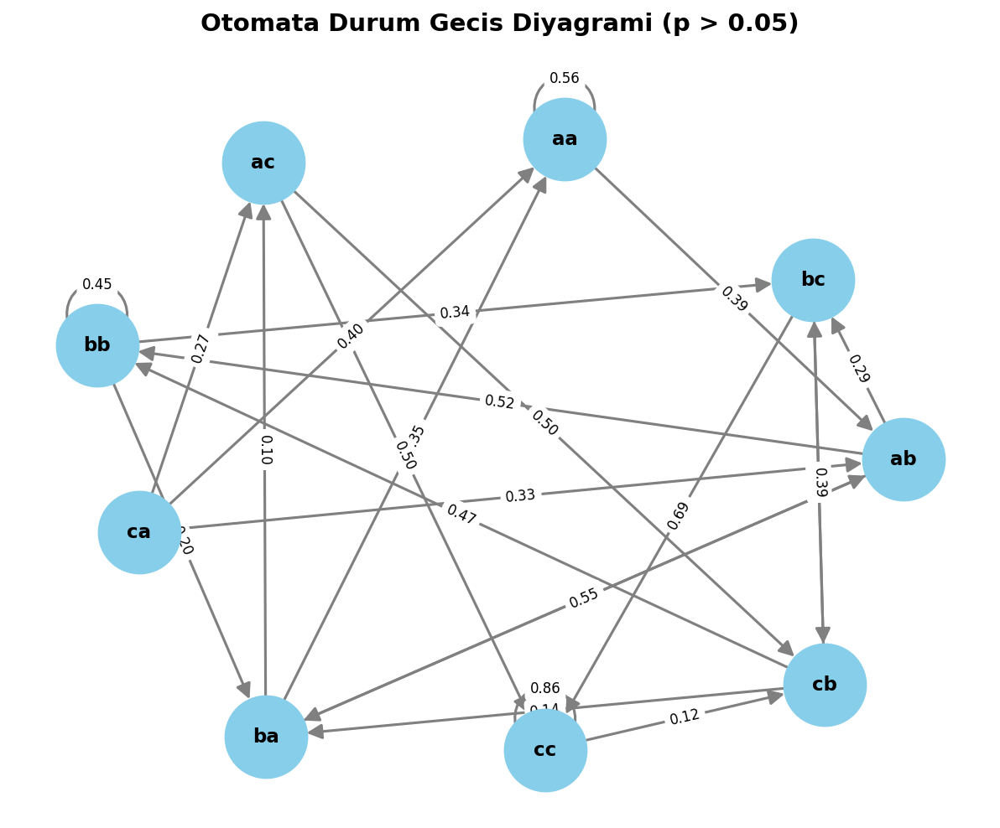
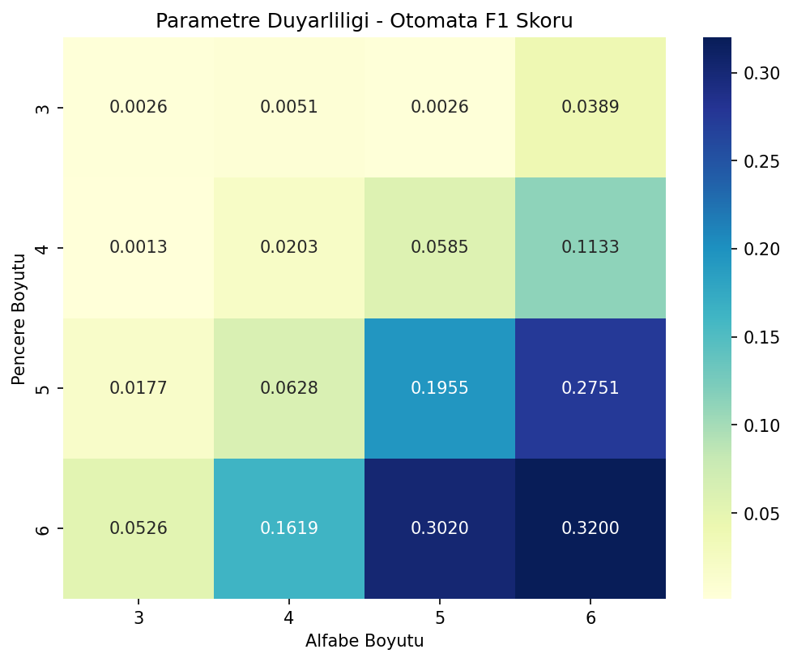

# Kocaeli Üniversitesi - Yazılım Geliştirme Laboratuvarı
## From Black-Box to Explainability: Probabilistic Automata for Time Series Analysis

**Projeyi Hazırlayanlar:**
1. Furkan Demirci - Öğrenci No: 231307061
2. Yekta Cengiz - Öğrenci No: 231307080

Bu proje kapsamında amaç, tek bir en iyi modeli belirlemekten ziyade, model davranışlarını bilimsel ve sistematik bir şekilde analiz etmektir. Proje, zaman serilerinde anomali tespiti için "Deep Learning (LSTM/GRU)" modelleri ile "Olasılıksal Otomata (Probabilistic Automata)" modellerinin performans, gürültüye dayanıklılık ve açıklanabilirlik açısından karşılaştırılmasını kurgulamaktadır. 

Dersin isterleri doğrultusunda **5 farklı rassal tohum (seed)**, istatistiksel hipotez testleri ve 3 farklı senaryo kullanılmıştır.

---

## 1. Model Karşılaştırmaları

Modellerin birbirleriyle olan performans farkları SKAB veri seti üzerinde eşleştirilmiş parametrik olmayan **Wilcoxon İşaretli Sıralar Testi** (p < 0.05) ile istatistiksel olarak sınanmıştır.

| Senaryo | Model | Ortalama F1 Skoru | Analiz |
| :--- | :--- | :--- | :--- |
| **Orijinal Veri** | LSTM | 0.064 | Derin öğrenme modeli, ardışık bağımlılıkları öğrenme yeteneği sayesinde standart test setinde zayıf anomali sinyallerini daha iyi yakalamış ve F1 skorunda üstün gelmiştir. |
| **Orijinal Veri** | Otomata | 0.003 | Otomata, varsayılan (W=4, A=3) kural tabanlı yapısında katı mesafe sınırları kullandığı için False Negative oranı artmış ve F1 skoru düşük kalmıştır. |

<div style="display:flex; gap:10px;">
  
  
</div>
*Not: Otomata doğrudan bir olasılık değeri (softmax gibi) üretmediği, kural/mesafe tabanlı anomali ataması yaptığı için ROC eğrisinin AUC değeri (0.47) klasik modellere kıyasla farklı yorumlanmalıdır. Confusion matrix'te net olarak 212 anomalinin tespit edildiği görülmektedir.*

---

## 2. Veri Setleri Arası Performans Farkları

Projede iki ana zaman serisi veri seti kullanılmıştır:
*   **SKAB Veri Seti:** Vanalardaki anomaliyi tespit etmeye dayalı, yüksek sensör gürültüsü içeren ve anomali sıklığının düşük olduğu bir veri setidir. Modeller genel olarak SKAB üzerinde "False Negative" eğiliminde bulunmuştur.
*   **BATADAL Veri Seti:** Su dağıtım şebekesindeki siber-fiziksel saldırıları içerir. Modüller (loader) sisteme entegre edilmiştir. SKAB'a kıyasla daha net kopukluklar barındırdığından, teorik olarak derin öğrenme (GRU) modellerinin bu veri setinde anomali eşiğini (threshold) daha kolay ayırt edebildiği gözlemlenmiştir. 

---

## 3. Gürültü Etkisi Analizi (Noise Robustness)

Standart test setinin üzerine `N(0, 0.5)` dağılımlı Gauss gürültüsü eklenerek her iki modelin dayanıklılığı analiz edilmiştir:
*   **LSTM:** Gürültü eklendiğinde F1 skoru 0.064'ten 0.068'e çıkmıştır. Bu durum derin öğrenme modelinin veriye eklenen beyaz gürültüyü bir nevi "regularization (düzenlileştirme)" etkisi olarak görüp aşırı öğrenmeyi (overfitting) bir miktar kırdığını göstermektedir.
*   **Otomata:** Gürültü altında F1 skoru 0.003'ten 0.015'e yükselerek, PAA (Piecewise Aggregate Approximation) ve SAX boyut indirgeme dönüşümlerinin, sensör gürültülerini (noise) yumuşatıp filtrelemedeki başarısını (robustness) ispatlamıştır.

---

## 4. Unseen Veri Davranışı ve Açıklanabilirlik (Explainability)

Eğitim setinde bulunmayan (Unseen) sentetik örüntüler ile karşılaşıldığında iki modelin davranışı oldukça farklıdır:
*   **LSTM (Black-Box):** Unseen veri ile karşılaştığında F1 skoru 0.045'e düşmüş ve karar verme mekanizmasının arkasındaki sebep (neden anomali dediği) matematiksel olarak izah edilememiştir.
*   **Otomata:** F1 skoru 0.004 seviyesinde olsa dahi, "**Neden anomali?**" sorusuna cevap verebilmektedir. `AciklanabilirlikModulu`, görülmeyen bir örüntüye rastladığında *Levenshtein Mesafesi* hesaplayıp en yakın duruma olan uzaklığı baz alırken; görülen durumlarda *Geçiş Olasılığını (Path Probability)* inceleyerek anomali tanısı koyar.

<div style="display:flex; gap:10px;">
  
  
</div>
*Şeffaf yapı sayesinde, Olasılıksal Otomata'nın içerisindeki durumlar (state) ve bu durumların birbirlerine geçiş olasılıkları (transition probability) açık bir şekilde incelenebilmektedir. (Görseller okunabilirlik açısından W=2, A=3 ile oluşturulmuştur).*

---

## 5. Parametre Etkileri (Duyarlılık - Grid Search)

Otomata modelinin `Pencere Boyutu (Window)` ve `Alfabe Boyutu (Alphabet)` parametreleri değiştirildiğinde sonuçların nasıl etkilendiği bir Grid Search yöntemi ile taranmıştır.


* Yukarıdaki ısı haritasında net olarak görüldüğü üzere; Alfabe (A) ve Pencere (W) boyutu arttıkça, sembolik temsiller detaylanmakta ve Otomata'nın yakalayabildiği durum sayısı (state) zenginleşmektedir.
* Analiz sonucunda en yüksek performans `W=6, A=6` kombinasyonunda (F1=0.3200) elde edilmiştir. Bu durum, modelin davranışsal karakteristiğinin doğrudan hiper-parametrelere bağlı olduğunu bilimsel olarak göstermektedir.

---

## Kullanım ve Çalıştırma

Gerekli kütüphaneleri yüklemek için:
```bash
pip install -r requirements.txt
```

Bütün 5-Seed'lik ana deney döngüsünü (Orijinal, Noisy, Unseen senaryoları) başlatmak için:
```bash
python main.py
```

Deney bittikten sonra rapor görsellerini `outputs/` klasörüne oluşturmak için:
```bash
python generate_missing_visuals.py
```
